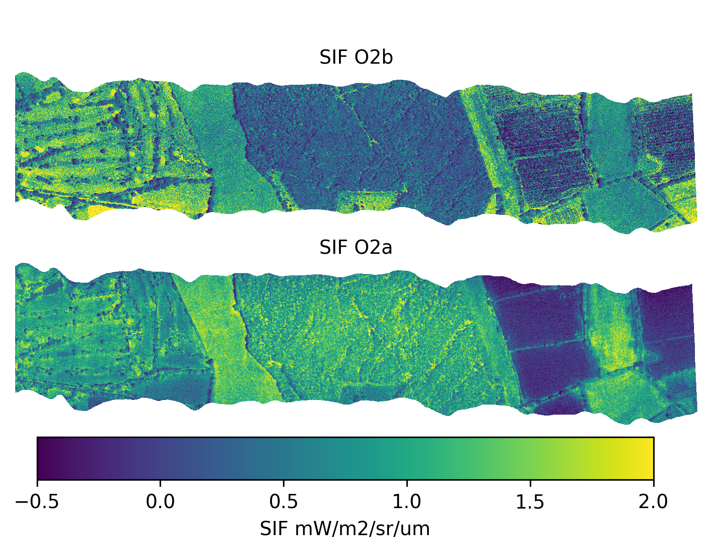

# proc_ibis

Tools for calculating SIF from IBIS data in ENVI BIL format that provided by NEODAAS after pre-processing.

Note: This code is a work in progress and is not yet at a level of maturity to produce high quality SIF products. Watch this space!

