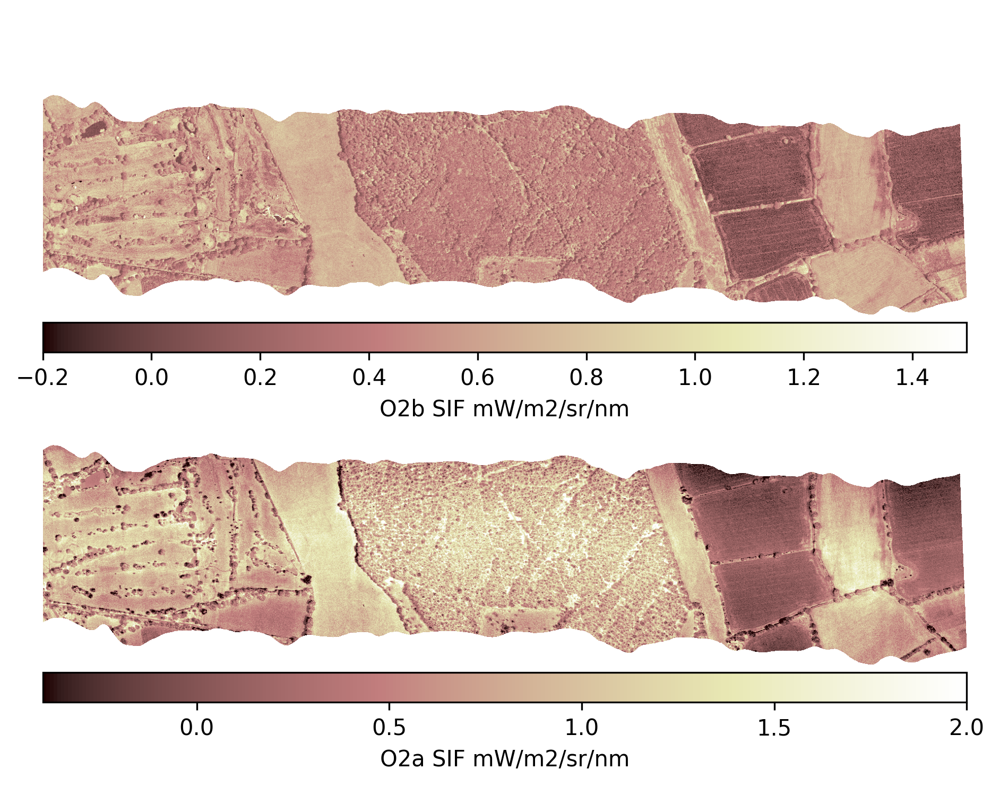

# proc_ibis

Tools for calculating SIF from IBIS data in ENVI BIL format that provided by NEODAAS after pre-processing.

A very simple example of using the module is as follows. In this example, results are written to a 
file as a Python pickle for later use. This code is also in the file `example.py`

```
#open ibis data 
ibis_filename="./data_in/i200073b_mapped_utm30n.bil"
ibis_data=ibisBilReader(ibis_filename)

#read in reference data
wref=Spectra(fname="./data_in/white_reference.csv",ftype="CSV",hdrLines=0)

#rFLD O2a
out_fn='./data_out/sif_o2a_rFLD.pickle'
sif_opts=sif_opts_FLD_Cendrero19_O2a
ibis_sif_rFLD(wref,ibis_data,2,10E6,2,10E6,sif_opts,out_fn,761.0) 
```


